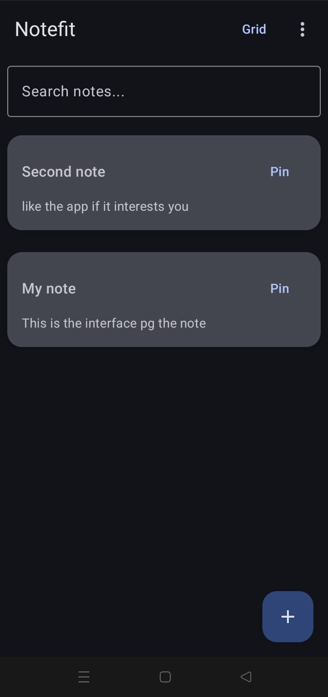
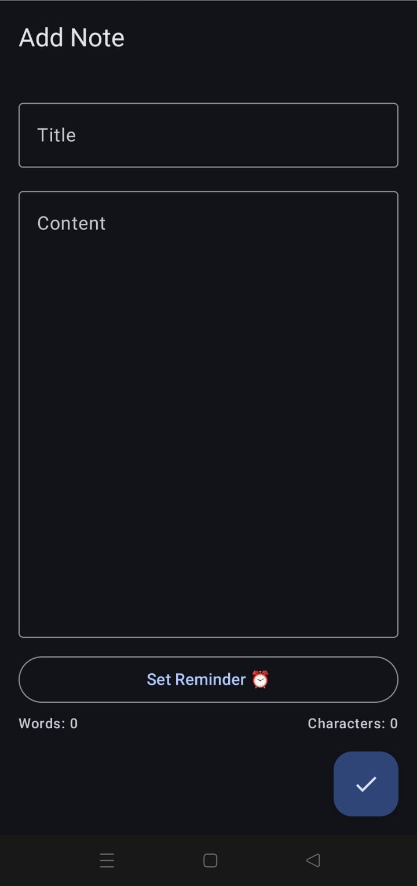
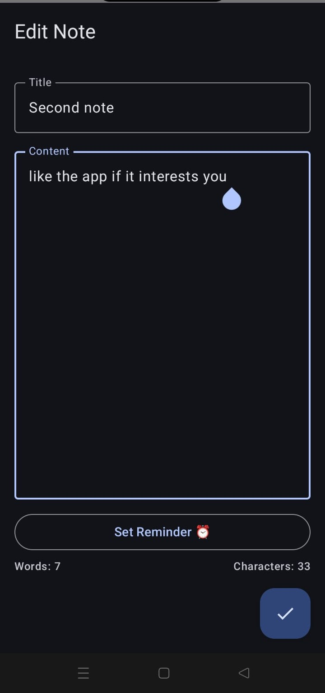
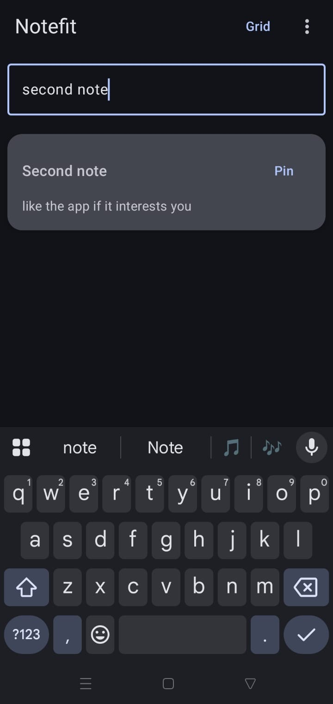
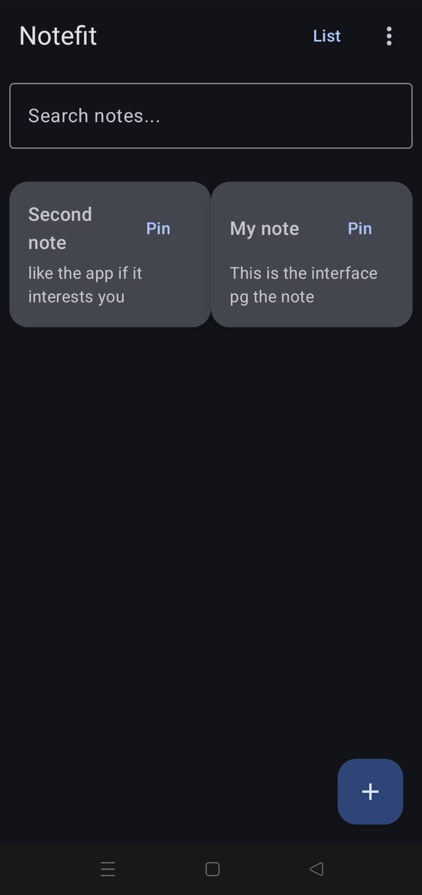
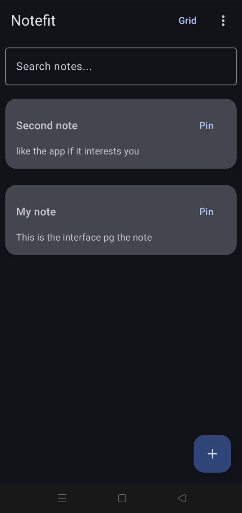
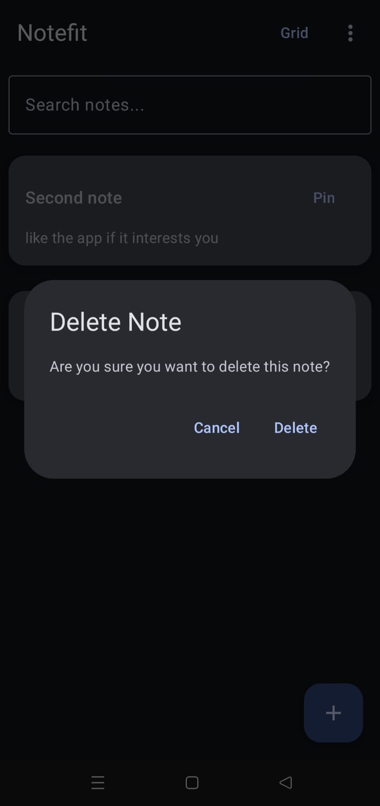
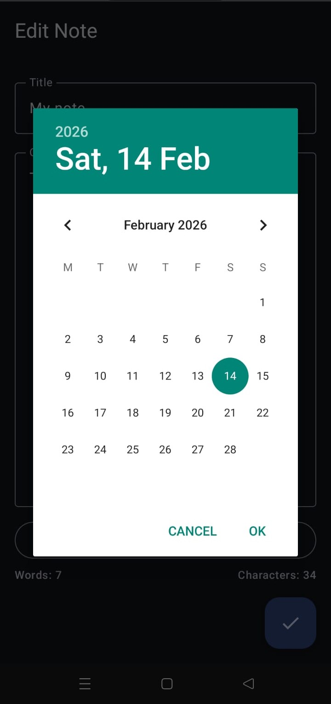
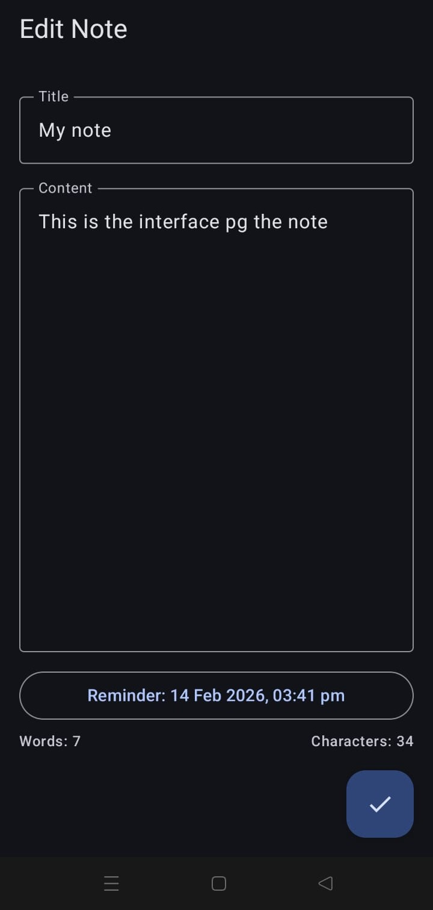

📒 Notefit1 — Modern Android Notes App

**Notefit1** is a modern Android notes application built using **Kotlin and Jetpack Compose**.
It provides a clean Material 3 UI with powerful productivity features like reminders, note pinning, search, sorting, and dark mode support.

This project demonstrates **MVVM architecture, Room database integration, and Android notification scheduling**.

## 🚀 Features

* ✍️ Create, edit, and swipe to delete notes
* 🔍 Search notes by title or content
* 🔽 Sort notes (date / title)
* 📌 Pin important notes
* 🧱 Grid and List view toggle
* 🌙 Dark mode support (System / Light / Dark)
* 🔢 Word and character count
* 🔔 Reminder notifications using AlarmManager
* ↩️ Undo delete with Snackbar
* 🎨 Clean Material 3 UI

---

## 🧰 Tech Stack

* **Language:** Kotlin
* **UI:** Jetpack Compose (Material 3)
* **Architecture:** MVVM
* **Database:** Room Database
* **State Management:** StateFlow / ViewModel
* **Notifications:** AlarmManager + BroadcastReceiver
* **Persistence:** DataStore Preferences

---

## 🏗 Architecture

The project follows **MVVM Architecture**:

* **Model** → Room database entities and DAO
* **ViewModel** → Business logic and UI state
* **View** → Jetpack Compose UI

This ensures separation of concerns and maintainable code.

---

## 📱 Screenshots

### 🏠 Home Screen

### ➕ Add Note

### ✏️ Edit Note

### 🔍 Search Notes

### 📋 List View

### 🌙 Dark Mode

### ☀️ Light Theme

### 🗑 Delete Note

### 🔔 Reminder Notification

### ⏰ Set Reminder

---

## 🔔 Reminder System Implementation

Users can set a reminder for any note.
The app schedules notifications using Android's AlarmManager, which triggers a BroadcastReceiver at the specified time to display a notification.

---

## 🎯 Learning Outcomes

* Jetpack Compose UI development
* Material 3 theming and dark mode
* Room database integration
* Android notification system
* MVVM architecture implementation
* Modern Android state management

---

## 👨‍💻 Author

**Virat Jaiswal**
B.Tech Final Year — Android Development

---

## ⭐ If you like this project, give it a star!
